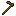
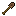
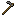
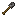
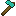
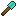
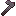
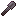

# jummy-test-mod
A bad Minecraft mod. For 1.16.4.
# Food
|Icon|Item|Hunger|Saturation|Effective quality|Effects|
|-|-|-|-|-|-|
||Apple Pie|6|4.5|10.5|-|
||Baked Poisonous Potato|7|4.2|11.2|Poison I 0:30 (60%)|
||Baked Sweet Potato|6|6|12|-|
||Breakfast|3|3|6|-|
||Cactus Juice|2|4|6|-|
||Cheese|1|0.2|1.2|-|
||Cheeseburger|14|21|35|-|
||Diamond Apple|4|8|12|Regeneration III 0:05 Absorption II 2:00|
||Diamond Emerald Baked Potato|5|6|11|Regeneration I 0:05|
||Doritos®|5|5|10|-|
||Energy Drink|1|2|3|*Various*\*|
||Gravel Bits|1|0|1|Hunger XX 0:01 Poison II 0:01 (10%)|
||Hamburger|13|20.5|33.5|-|
||Lava Baked Potato|5|5|10|-|
||Leaf|1|0|1|-|
||Marshmallow|1|0.2|1.2|-|
||Overcooked Chicken|5|0|5|-|
||Overcooked Potato|5|0|5|-|
||Overcooked Steak|7|0|7|-|
||Plastic|0|0|0|Hunger I 0:10 (20%)|
||Sweet Baked Potato|6|6|12|-|
||Sweet Potato|1|0.8|1.8|-|
||This is not a glitch.|0|0|0|-|
||Twinkie|2|0.5|2.5|-|
||Very Poisonous Potato|12|7.2|19.2|Poison IV 0:30|
||Wet Apple|4|2.4|6.4|-|

\* The following positive effects each have a 15% chance of occurring, at level I for 30 seconds: Speed, Strength, Jump Boost, Absorption, Haste, Resistance, and Regeneration. Additionally, there is a 15% chance for 0.5 seconds of Saturation I, and a 15% chance for 0.15 seconds of Instant Health I.
The following negative effects have a 2% chance of occurring, individually at both level I and level II for 30 seconds: Poison, Hunger, Slowness, Weakness, and Mining Fatigue.
# Tools
## Overview
|Icon|Material|Durability|Enchantability|Mining tier|Mining speed|
|-|-|-|-|-|-|
||Air|6|1|0|1.0|
||Dirt|25|32|0|1.4|
||Log|236|8|0|1.5|
||Gold Block|288|11|0|9.0|
||Gravel|59|10|★|3.0|
||Obsidian|3592|5|★|6.0|
||Iron Block|2250|7|★★|4.5|
||Diamond Block|14049|5|★★★|6.0|
||Bedrock|65535|1|★★★★|1.0|
||Netherite Block|18279|8|★★★★|6.75|
||*Wood*|59|15|0|2.0|
||*Gold*|32|22|0|12.0|
||*Stone*|131|5|★|4.0|
||*Iron*|250|14|★★|6.0|
||*Diamond*|1561|10|★★★|8.0|
||*Netherite*|2031|15|★★★★|9.0|
## Breakdown
|Icon|Tool|Damage|Speed|DPS|
|-|-|-|-|-|
||Air Hoe|1.0|4.0|4.0|
||Air Shovel|1.0|4.0|4.0|
||Air Pickaxe|1.0|4.0|4.0|
||Air Axe|1.0|4.0|4.0|
||Air Sword|1.0|4.0|4.0|
||Bedrock Hoe|4.0|0.02|0.08|
||Bedrock Shovel|11.0|0.005|0.055|
||Bedrock Pickaxe|10.0|0.006|0.06|
||Bedrock Axe|18.0|0.005|0.09|
||Bedrock Sword|14.0|0.008|0.112|
||Dirt Hoe|1.0|1.0|1.0|
||Dirt Shovel|2.5|1.0|2.5|
||Dirt Pickaxe|2.0|1.0|2.0|
||Dirt Axe|5.0|0.8|4.0|
||Dirt Sword|4.0|1.4|5.6|
||Thick Wooden Hoe|1.0|0.75|0.75|
||Thick Wooden Shovel|2.5|0.75|1.875|
||Thick Wooden Pickaxe|2.0|0.9|1.8|
||Thick Wooden Axe|7.0|0.6|4.2|
||Thick Wooden Sword|4.0|1.2|4.8|
||Thick Golden Hoe|1.0|0.75|0.75|
||Thick Golden Shovel|2.5|0.75|1.875|
||Thick Golden Pickaxe|2.0|0.9|1.8|
||Thick Golden Axe|7.0|0.75|5.25|
||Thick Golden Sword|4.0|1.2|4.8|
||Gravel Hoe|2.0|1.0|2.0|
||Gravel Shovel|3.5|1.0|3.5|
||Gravel Pickaxe|3.0|1.2|3.6|
||Gravel Axe|8.0|0.8|6.4|
||Gravel Sword|4.0|1.6|6.4|
||Thick Iron Hoe|1.0|2.25|2.25|
||Thick Iron Shovel|4.5|0.75|3.375|
||Thick Iron Pickaxe|4.0|0.9|3.6|
||Thick Iron Axe|9.0|0.675|6.075|
||Thick Iron Sword|6.0|1.2|7.2|
||Thick Diamond Hoe|1.0|3.0|3.0|
||Thick Diamond Shovel|5.5|0.75|4.125|
||Thick Diamond Pickaxe|5.0|0.9|4.5|
||Thick Diamond Axe|9.0|0.75|6.75|
||Thick Diamond Sword|7.0|1.2|8.4|
||Thick Netherite Hoe|1.0|3.0|3.0|
||Thick Netherite Shovel|6.5|0.75|4.875|
||Thick Netherite Pickaxe|6.0|0.9|5.4|
||Thick Netherite Axe|10.0|0.75|7.5|
||Thick Netherite Sword|8.0|1.2|9.6|
||Obsidian Hoe|2.0|0.5|1.0|
||Obsidian Shovel|4.5|0.5|2.25|
||Obsidian Pickaxe|4.0|0.6|2.4|
||Obsidian Axe|10.0|0.45|4.5|
||Obsidian Sword|7.0|0.8|5.6|
||*(empty hand)*|1.0|4.0|4.0|
||*Wooden Hoe*|1.0|1.0|1.0|
||*Wooden Shovel*|2.5|1.0|2.5|
||*Wooden Pickaxe*|2.0|1.2|2.4|
||*Wooden Axe*|7.0|0.8|5.6|
||*Wooden Sword*|4.0|1.6|6.4|
||*Golden Hoe*|1.0|1.0|1.0|
||*Golden Shovel*|2.5|1.0|2.5|
||*Golden Pickaxe*|2.0|1.2|2.4|
||*Golden Axe*|7.0|1.0|7.0|
||*Golden Sword*|4.0|1.6|6.4|
||*Stone Hoe*|1.0|2.0|2.0|
||*Stone Shovel*|3.5|1.0|3.5|
||*Stone Pickaxe*|3.0|1.2|3.6|
||*Stone Axe*|9.0|0.8|7.2|
||*Stone Sword*|5.0|1.6|8.0|
||*Iron Hoe*|1.0|3.0|3.0|
||*Iron Shovel*|4.5|1.0|4.5|
||*Iron Pickaxe*|4.0|1.2|4.8|
||*Iron Axe*|9.0|0.9|8.1|
||*Iron Sword*|6.0|1.6|9.6|
||*Diamond Hoe*|1.0|4.0|4.0|
||*Diamond Shovel*|5.5|1.0|5.5|
||*Diamond Pickaxe*|5.0|1.2|6.0|
||*Diamond Axe*|9.0|1.0|9.0|
||*Diamond Sword*|7.0|1.6|11.2|
||*Netherite Hoe*|1.0|4.0|4.0|
||*Netherite Shovel*|6.5|1.0|6.5|
||*Netherite Pickaxe*|6.0|1.2|7.2|
||*Netherite Axe*|10.0|1.0|10.0|
||*Netherite Sword*|8.0|1.6|12.8|
# Blocks
|Icon|Item|Tool|Hardness|Blast resistance|Drops|
|-|-|-|-|-|-|
||7UP® Cap|Any|0|0|*Self*|
||Block of Milk|Any|1|1|*Self*|
||Breakfast Block|Pickaxe|2|6|*Self*|
||Coca-Cola® Cap|Any|0|0|*Self*|
||Dr. Pepper® Cap|Any|0|0|*Self*|
||Funnel Cake|Pickaxe|3|4.8|Cake + Hopper|
||Green|Any|0|0|*Self*|
||Half Powered Nether Reactor|Diamond Pickaxe|5|1200|*Self*|
||Nether Reactor|Diamond Pickaxe|5|1200|*Self*|
||Powered Nether Reactor|Diamond Pickaxe|5|1200|*Random Nether items*
||(Block of)ⁿ Coal|Pickaxe|5n|6 · 9ⁿ⁻¹|*Self*|
||(Block of)ⁿ Diamond|Iron Pickaxe|5n|6 · 9ⁿ⁻¹|*Self*|
||(Block of)ⁿ Emerald|Iron Pickaxe|5n|6 · 9ⁿ⁻¹|*Self*|
||(Block of)ⁿ Gold|Iron Pickaxe|3n|6 · 9ⁿ⁻¹|*Self*|
||(Block of)ⁿ Iron|Stone Pickaxe|5n|6 · 9ⁿ⁻¹|*Self*|
||(Block of)ⁿ Lapis Lazuli|Stone Pickaxe|3n|3 · 9ⁿ⁻¹|*Self*|
||(Block of)ⁿ Netherite|Diamond Pickaxe|50n|1200 · 9ⁿ⁻¹|*Self*|
||(Block of)ⁿ Redstone|Iron Pickaxe|5n|6 · 9ⁿ⁻¹|*Self*|
# Recipes
## Plastic
4× Sugar Cane → 4×  Plastic 
`s` `s` 
`s` `s`

7×  Plastic →  Shades 
`p` `·` `p` 
`p` `·` `p` 
`p` `p` `p`

 Plastic + Red Dye →  7UP® Cap 
`r` `·` 
`p` `·`

 Plastic + Red Dye →  Coca-Cola® Cap 
`p` `·` 
`r` `·`

 Plastic + Red Dye →  Dr. Pepper® Cap 
`·` `·` 
`r` `p`
## Dollar Bills
Gold Ingot + Paper →  One Dollar Bill

 One Dollar Bill → Gold Ingot

5×  One Dollar Bill ⇄  Five Dollar Bill

2×  Five Dollar Bill ⇄  Ten Dollar Bill

\* *This pattern continues up to a  One Hundred Dollar Bill. Consecutive denominations can be combined to reach the next. For example:*

2×  Twenty Dollar Bill +  Ten Dollar Bill →  Fifty Dollar Bill

## Nether Reactor
3× Netherite Ingot + 6× Obsidian  →  Nether Reactor 
`O` `n` `O` 
`O` `n` `O` 
`O` `n` `O`

 Nether Reactor + 4× Block of Gold + 4× Glowstone Block →  Half Powered Nether Reactor 
`G` `L` `G` 
`L` `N` `L` 
`G` `L` `G` 
****G**** = Block of Gold 
****L**** = Glowstone Block 
****N**** =  Nether Reactor

 Half Powered Nether Reactor + 4× Block of Gold + 4× Glowstone Block →  Powered Nether Reactor 
`G` `L` `G` 
`L` `H` `L` 
`G` `L` `G` 
****G**** = Block of Gold 
****L**** = Glowstone Block 
****H**** =  Half Powered Nether Reactor
## (Block of)ⁿ Ore
9× Block of Coal ⇄  (Block of)² Coal

\* *This pattern applies to all compressed ore blocks.  Following the same pattern, the Block² can be combined into Block³ and so on, up to an exponent of 5.*
## Other
9× Green Dye ⇄  Green

Brick + Red Dye + Yellow Dye →  Breakfast

4×  Breakfast ⇄  Breakfast Block 
`b` `b` 
`b` `b`

Cake + Hopper →  Funnel Cake

Milk Bucket →  Milk + Bucket

 Milk → 4×  Cheese

9×  Milk ⇄  Block of Milk

# Concepts
["7up cap" by butterbro](https://www.tynker.com/minecraft/items/view/slimeball/7up-cap/59bd6f8e5ae029356c8b4567)

["bekfast" by tbd.nintendo](https://www.tynker.com/minecraft/items/view/brick/bekfast/594005ea76f2935b5a8b45b7)

["burned steak..." by Joshua](https://www.tynker.com/minecraft/items/view/beef_raw/burned-steak-/58dab93d5ae0293a738b457f)

["burnt chicken" by unknown](https://www.tynker.com/minecraft/items/view/charcoal/burnt-chicken/5841a80eb84fdc27238b456d)

["cactus juice" by Sebasti...](https://www.tynker.com/minecraft/items/view/beetroot_soup/cactus-juice/58891c4f5ae0293c708b458f)

["Cheese Burger" by bioticslaya](https://www.tynker.com/minecraft/items/view/potato_baked/cheese-burger/5a54fb9bd45ae986278b4610)

["chese" by pos20000](https://www.tynker.com/minecraft/items/view/beetroot/chese/59a8c0af1c36d159038b456e)

["cokacola cap" by butterbro](https://www.tynker.com/minecraft/items/view/string/cokacola-cap/59bd73a0949b56151c8b4567)

["Completely Black Flint" by nylan](https://www.tynker.com/minecraft/items/view/flint/completely-black-flint/59eb91bb1c36d10c258b4610)

["cook poison putao" by whatup](https://www.tynker.com/minecraft/items/view/potato_baked/cook-poison-putao/59de0e4f949b569c368b4572)

["Diamond💎 Apple" by 𝚟𝚒𝚛𝚞𝚜](https://www.tynker.com/minecraft/items/view/apple_golden/diamond-apple/59934d0e76f2935c4c8b45ac)

["Diamond Emerald Potato" by Daniel](https://www.tynker.com/minecraft/items/view/potato_baked/diamond-emerald-potato/57b66a9365e4f26d7a8b4578)

["Diamond String" by Ziggy](https://www.tynker.com/minecraft/items/view/string/diamond-string/5a0523701c36d12f798b4576)

["dirt pickaxe" by mark](https://www.tynker.com/minecraft/items/view/wood_pickaxe/dirt-pickaxe/593affdd5ae0290c5a8b4577)

["Doritos" by Legendary Gamer](https://www.tynker.com/minecraft/items/view/potato_baked/doritos/58bdad6b1c36d1af248b4582)

["dr.peper cap" by butterbro](https://www.tynker.com/minecraft/items/view/chorus_fruit_popped/dr-peper-cap/59bd77021c36d118418b457a)

["ender string" by Ethan](https://www.tynker.com/minecraft/items/view/string/ender-string/57bdffe651684ff02c8b4567)

["energy drink you can actualy drink it" by unknown](https://www.tynker.com/minecraft/items/view/bucket_milk/energy-drink-you-can-actualy-drink-it/59f0ab9f5ae029670a8b4567)

["funnel cake" by Andres](https://www.tynker.com/minecraft/items/view/hopper/funnel-cake/58f8087a76f29349468b45c1)

["gravel" by stinking dark](https://www.tynker.com/minecraft/items/view/hopper/gravel/584dda47b819da22588b456a)

["Gravel Sword" by EVERYBO...](https://www.tynker.com/minecraft/items/view/diamond_sword/gravel-sword/5a85f51e949b56da078b45a0)

["Green" by Bobo1234](https://www.tynker.com/minecraft/items/view/beef_raw/green/5a57bb4c949b5649578b4567)

["hamburger" by mckay](https://www.tynker.com/minecraft/items/view/beetroot_seeds/hamburger/59b9cefc1c36d188448b4581)

["item.leaf.name" by Douglas](https://www.tynker.com/minecraft/items/view/dye_powder_green/item-leaf-name/5727728765e4f223678b456d)

["marshmallow" by realff39](https://www.tynker.com/minecraft/items/view/porkchop_raw/marshmallow/585ebf7108702c1e4a8b456b)

["mega Nether star helmet" by TheRubySaber](https://www.tynker.com/minecraft/items/view/bone/mega-nether-star-helmet/5964cd395ae02909548b4568)

["obsidian pickaxe" by pokemongo1234](https://www.tynker.com/minecraft/items/view/gold_pickaxe/obsidian-pickaxe/59af64e65ae029e72b8b4567)

["one doller" by Kyle](https://www.tynker.com/minecraft/items/view/emerald/one-doller/5a8cbbd45ae029cd0c8b456d)

["Overcooked Potato" by Shellbe...](https://www.tynker.com/minecraft/items/view/potato_baked/overcooked-potato/57e402e551684f89758b458d)

["p09uhhbvxgfggv" by Tyeler](https://www.tynker.com/minecraft/items/view/map_empty/p09uhhbvxgfggv/597b449676f293543e8b45d3)

["patato cooked with lava" by necles](https://www.tynker.com/minecraft/items/view/potato_baked/patato-cooked-with-lava/581223caa92405c2038b4575)

["salt" by unknown](https://www.tynker.com/minecraft/items/view/gunpowder/salt/59bacdf176f293766b8b45ae)

["striiiiiiiiiiiiiiiiing" by hacker](https://www.tynker.com/minecraft/items/view/string/striiiiiiiiiiiiiiiiing/597a4cd576f293e24b8b4567)

["Sweet potato" by Christi...](https://www.tynker.com/minecraft/items/view/potato_baked/sweet-potato/59e79ac7949b56ab548b45da)

["This is not a glitch." by a dino](https://www.tynker.com/minecraft/items/view/dye_powder_white/this-is-not-a-glitch-/594c89e4949b56be528b45bf)

["very poisonus potatoe" by Avril](https://www.tynker.com/minecraft/items/view/potato_poisonous/very-poisonus-potatoe/599605111c36d1196d8b4576)

["Wet Apple" by Henry](https://www.tynker.com/minecraft/items/view/apple/wet-apple/59debec35ae029d4608b4572)
